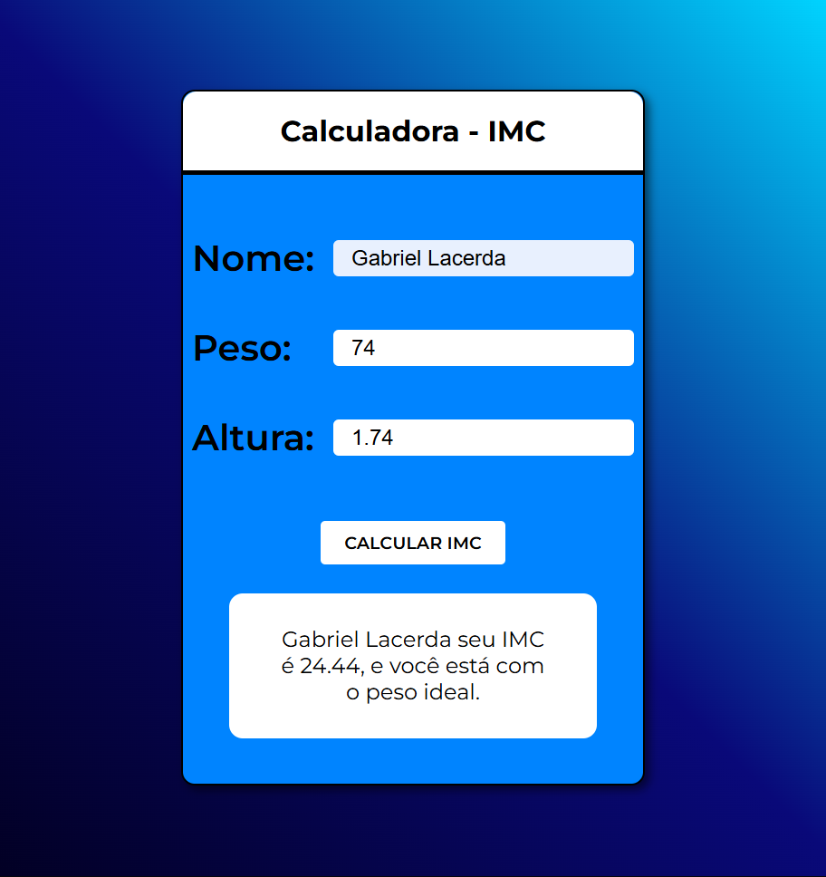

# Calculadora de IMC



---

### 📋 Descrição do Projeto

Uma página web simples e funcional criada para calcular o Índice de Massa Corporal (IMC) com base no peso e na altura fornecidos pelo usuário.

### 🚀 Tecnologias Utilizadas

- **HTML5:** Para a estrutura e marcação da página.
- **CSS3:** Para a estilização e o design da interface.
- **JavaScript:** Para a lógica de cálculo do IMC e a manipulação do DOM.

### ✨ Funcionalidades

- **Cálculo de IMC:** Insira seu peso e altura para obter seu IMC.
- **Resultado:** A calculadora fornece o valor do IMC calculado.

### 📦 Como Executar o Projeto

1.  **Clone o repositório:**
    ```bash
    git clone [https://github.com/GabrielPKTN/calculadora-imc-js.git](https://github.com/GabrielPKTN/calculadora-imc-js.git)
    ```
2.  **Navegue até o diretório do projeto:**
    ```bash
    cd calculadora-imc-js
    ```
3.  **Abra o arquivo `index.html` em seu navegador de preferência.**

### ✒️ Autor

- **GabrielPKTN**
- GitHub: [GabrielPKTN](<https://github.com/GabrielPKTN>)
- Linkedin: [Gabriel Lacerda](<https://www.linkedin.com/in/gabriellacerda1005/>)